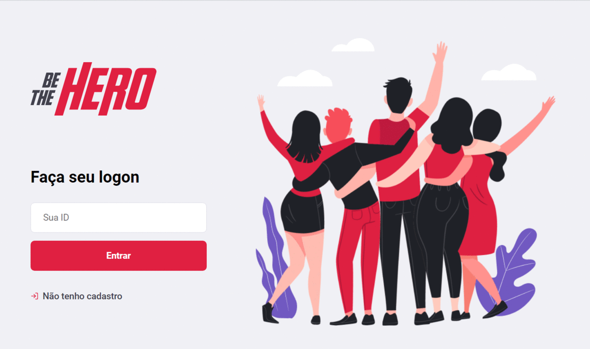

# SemanaOmniStack11
O objetivo desse projeto é replicar a aplicação chamada Be The Hero. 
Essa aplicação foi desenvolvida na Semana OmniStack 11 realizada pela Rocketseat. 

## Objetivos da aplicação
    - Criar um sistema web onde as ONGs possam sem cadastrar e solicitar ajuda informando alguns dados dos casos onde ela precisa de contribuição.
    - Criar um app mobile para que as pessoas (hérois) que querem contriuir possam descobrir os casos e enviar mensagens de e-mail ou whatsapp para as ONGs.

## Tecnologias utilizadas
    - Backend com NodeJS
    - Frontend com ReacJS
    - Mobile com React-Native

## Aula 1 - Conhecendo a OmniStack - 23/03/2020
    - Apresentação da aplicação
    - Configurar ambiente de desenvolvimento
        - Node.js & NPM
        - Visual Studio Code
    - Entender sobre o back-end e front-end
    - Criar projeto com Node.js
    - Endenter sobre o React e SPA
    - Criar Projeto com ReactJS
    - Entender sobre React Native e Expo

## Aula 2 - Criando a base da aplicação - 24/03/2020
    - Node.js e Express
        - Rotas e recursos
        - Métodos HTTP
        - Tipos de parâmetros
    - Configurando Nodemon
    - Utilizando Insomnia
    - Diferenças entre bancos de dados
    - Configurando banco de dados
    - Pensando nas entidades e funcionalidades
    - Construção do back-end
    - Adicionando módulo CORS
    - Enviando back-end ao Github.
    
## Aula 3 - Construindo a interface WEB - 25/03/2020
    - Limpando estrutura
    - Conceitos do React
        - Componente
        - JSX
        - Propriedades
        - Estado
        - Imutabilidade
    - Página de login
    - Configurando rotas
    - Cadastrar de ONGs
    - Listagem de casos
    - Cadastrar de um novo caso
    - Conectar aplicação à API
    - Enviar projeto ao Github

## Aula 4 - Desenvolvendo o app mobile - 26/03/2020
    - Instalando o Expo
    - Criando projeto React Native
    - Executando projeto
        - No celular
        - Emuladores
        - Expo Snack
    - Diferenças para o ReactJS
        - Elementos HTML
        - Semântica
        - Estilização
            - Flexbox
            - Propriedades
            - Herança de estilos
            - Estilização própria
        - Estrutura de pastas
        - Ícone e Splash Screen
        - Configurando navegação
        - Página de casos
        - Detalhe do caso
        - Abrindo Whatsapp & E-mail
        - Conexão com API
        - Enviando projeto ao Github

## Aula 5 - Funcionalidades avançadas - 27/03/2020
    - Adicionando validação
    - Adicionando testes
        - Por que fazer testes?
        - TDD (Test-driven Development)
        - Configurando Jest
        - Tipos de testes
        - Configurando banco de testes
        - Instalando supertest
        - Testando rota de autenticação
    - Deploy
        - Alternativas
        - Qual escolher
    - Estudos daqui pra frente
        - Padrões de código: ESLint, Prettier (Youtube)
        - Autenticação JWT (Youtube)
        - Styled Components (Youtube)
    - Dicas para aproveitar melhor
        - Github
        - Linkedin

## Telas do frontend Web

## Telas do frontend Mobile
